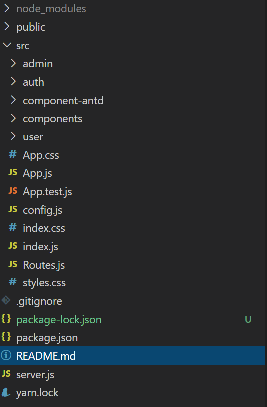

# A-Mazon-Server-Web

Build your own A-Mazon-Server-Web applicaion with React, Node.js, Express and MongoDB with MVC Pattern.

- [A-Mazon-Server-Web: Demo](http://167.71.146.22/)

- [Applied to My Reponsive Portfolio](https://eunsoojung.github.io/Responsive-Portfolio/portfolio.html)

## Getting Started

These instructions will get you a copy of the project up and running on your local machine for development and testing purposes.
See deployment for notes on how to deploy the project on a live system.

```bash
# Install packages
    "antd": "^3.26.9",
    "braintree-web-drop-in-react": "^1.1.0",
    "dotenv": "^8.2.0",
    "moment": "^2.24.0",
    "query-string": "^6.11.0",
    "react": "^16.12.0",
    "react-dom": "^16.12.0",
    "react-router-dom": "^5.1.2",
    "react-scripts": "3.4.0"
# Run
npm start
```
[]

## Usage

### Basic Usage

To get A-Mazon-Server-Web, after downloading, you need to make sure Git Bash terminal open and looking at the correct folder. When you are within the correct location, you may type the following commands to ask her for information:

- npm start

### Guidelines:

- Proceeds as follows:

To use this applicaion, Clone the applicaion to your local git repository or directory:

- In your terminal, git clone https://github.com/EunsooJung/A-Mazon-Web.git

To start:

- You have to install npm packages depend on my package.json file: "npm install"
- Open your terminal then "npm start"

### Code Snippet

- Project structure

  []

1. admin: It provides category, product, order management UI and API call to Server-Side.
2. auth: It provides user authentication components
   3: components: This folder includes Layout, Menu, Cart Product UI components
3. user: This components provides user sign-up/in dashboards, profile functionality for Front-End
4. config: It provides API method for REACT_APP_API_URL form from .env
5. Routes.js: It provides map front-end to server
6. .env: It provides REACT_APP_API_URL address to communicate with server
7. server.js: It includes client-side server configuration to use Cloudfare server

## Built With

- [ReacJS](https://reactjs.org/)
- [Bootstrap](https://getbootstrap.com/)
- [AntD](https://ant.design/)
- [Express](https://expressjs.com/)
- [Express-validator](https://express-validator.github.io/docs/)
- [Mongoose](https://mongoosejs.com/)
- [Atlas-MongoDB](https://www.mongodb.com/cloud/atlas)
- [Body-parser](https://www.npmjs.com/package/body-parser)
- [Cookie-parser](https://www.npmjs.com/package/cookie-parser)
- [Cors](https://www.npmjs.com/package/cors)
- [Dotenv](https://www.npmjs.com/package/dotenv)
- [Morgan](https://www.npmjs.com/package/morgan)
- [Formidable](https://www.npmjs.com/package/formidable)
- [Braintree](https://developers.braintreepayments.com/)
- [Nodemon](https://nodemon.io/)
- [Cloudfare](https://www.cloudflare.com/)


## Authors

- **Lucas Coffee**
- **Tai Le**
- **Michael(Eunsoo)Jung**

* [A-Mazon-Server: Demo](http://167.71.146.22/)
* [Lucas' Portfolio](https://github.com/kalashnikoffee)
* [Tai's Portfolio](https://github.com/TaiLe96)
* [Michael's Portfolio](https://eunsoojung.github.io/Responsive-Portfolio/portfolio.html)
* [Link to A-Mazon-Server-Web Github: Clien-Side](https://github.com/EunsooJung/A-Mazon-Web.git)
* [Link to A-Mazon-Server Github: Server-Side](https://github.com/EunsooJung/A-Mazon-Server.git)
* [Link to LinkedIn](www.linkedin.com/in/eun-soo-jung/)

## License

This project is licensed under the MIT License

This project was bootstrapped with [Create React App](https://github.com/facebook/create-react-app).

## Available Scripts

In the project directory, you can run:

### `yarn start`

Runs the app in the development mode.<br />
Open [http://localhost:3000](http://localhost:3000) to view it in the browser.

The page will reload if you make edits.<br />
You will also see any lint errors in the console.

### `yarn test`

Launches the test runner in the interactive watch mode.<br />
See the section about [running tests](https://facebook.github.io/create-react-app/docs/running-tests) for more information.

### `yarn build`

Builds the app for production to the `build` folder.<br />
It correctly bundles React in production mode and optimizes the build for the best performance.

The build is minified and the filenames include the hashes.<br />
Your app is ready to be deployed!

See the section about [deployment](https://facebook.github.io/create-react-app/docs/deployment) for more information.

### `yarn eject`

**Note: this is a one-way operation. Once you `eject`, you can’t go back!**

If you aren’t satisfied with the build tool and configuration choices, you can `eject` at any time. This command will remove the single build dependency from your project.

Instead, it will copy all the configuration files and the transitive dependencies (webpack, Babel, ESLint, etc) right into your project so you have full control over them. All of the commands except `eject` will still work, but they will point to the copied scripts so you can tweak them. At this point you’re on your own.

You don’t have to ever use `eject`. The curated feature set is suitable for small and middle deployments, and you shouldn’t feel obligated to use this feature. However we understand that this tool wouldn’t be useful if you couldn’t customize it when you are ready for it.

## Learn More

You can learn more in the [Create React App documentation](https://facebook.github.io/create-react-app/docs/getting-started).

To learn React, check out the [React documentation](https://reactjs.org/).

### Code Splitting

This section has moved here: https://facebook.github.io/create-react-app/docs/code-splitting

### Analyzing the Bundle Size

This section has moved here: https://facebook.github.io/create-react-app/docs/analyzing-the-bundle-size

### Making a Progressive Web App

This section has moved here: https://facebook.github.io/create-react-app/docs/making-a-progressive-web-app

### Advanced Configuration

This section has moved here: https://facebook.github.io/create-react-app/docs/advanced-configuration

### Deployment

This section has moved here: https://facebook.github.io/create-react-app/docs/deployment

### `yarn build` fails to minify

This section has moved here: https://facebook.github.io/create-react-app/docs/troubleshooting#npm-run-build-fails-to-minify
